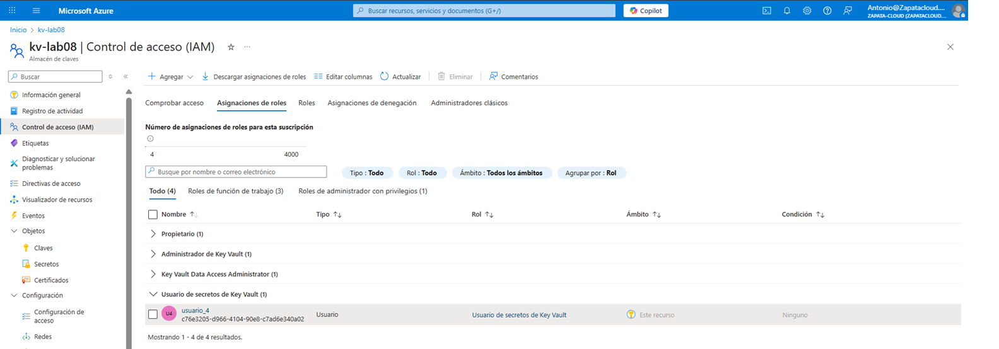
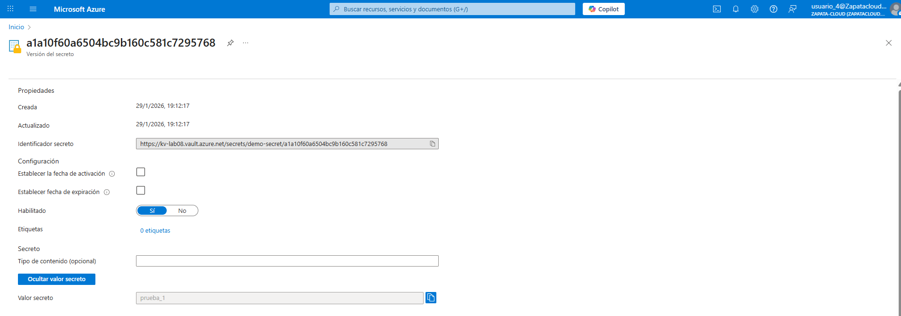
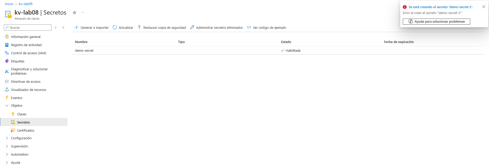

# Lab 08 — RBAC: Acceso a secretos en Key Vault con mínimo privilegio | Azure

## Contexto (por qué lo hice)
En entornos reales, no todo el mundo que trabaja con una suscripción necesita permisos de creación o administración.  
Un caso típico: un perfil **no técnico** (auditoría/soporte/finanzas) puede necesitar **consultar un secreto** (por ejemplo, una cadena de conexión, token o contraseña temporal) sin tener capacidad de **crear/modificar** nada.

En este lab aplico **mínimo privilegio** usando **Azure RBAC** sobre un **Azure Key Vault**, validando en la práctica:
- Un usuario puede **leer secretos**
- Pero **no puede crear** nuevos secretos ni hacer tareas de administración

---

## Objetivo
Aplicar **segregación de funciones** y **mínimo privilegio** a nivel de **Key Vault**:
- Permitir lectura de secretos a un usuario de pruebas (`usuario_4`)
- Impedir operaciones de escritura/administración (crear secretos, administrar el vault, etc.)
- Dejar evidencia con capturas reales

---

## Recursos utilizados
- **Azure Key Vault**: `kv-lab08`
- Secreto de prueba: `demo-secret`
- Usuario de pruebas: `usuario_4`
- Modelo de permisos del Key Vault: **Control de acceso basado en rol de Azure (RBAC)**

---

## Tareas realizadas
1. **Creación del secreto** `demo-secret` en el Key Vault (para disponer de un objeto real que validar).
2. Asignación de rol RBAC al usuario de pruebas:
   - **Rol:** `Usuario de secretos de Key Vault`
   - **Ámbito (scope):** `kv-lab08` (este recurso)
3. Validación práctica:
   - El usuario de pruebas puede **acceder/leer** secretos existentes
   - El usuario de pruebas **no puede crear** secretos nuevos (operación denegada)

---

## Evidencias

### 01) Asignación RBAC al usuario de pruebas (solo lectura de secretos)

### 02) Acceso permitido: lectura del secreto como `usuario_4`

### 03) Acceso denegado: intento de crear/modificar como `usuario_4`

---

## Checklist de verificación
- [x] El Key Vault usa **RBAC de Azure** (no Access Policies)
- [x] `usuario_4` tiene rol **Usuario de secretos de Key Vault** en `kv-lab08`
- [x] `usuario_4` puede **leer** el secreto `demo-secret`
- [x] `usuario_4` **no puede crear** secretos (mínimo privilegio aplicado)

---

## Qué explicaría en una entrevista / a un cliente
“Para controlar el acceso a información sensible, uso **Azure RBAC** sobre **Key Vault**.  
Asigno al perfil solo el rol necesario (por ejemplo, **Usuario de secretos de Key Vault** para lectura) y valido que:
- puede acceder a los secretos que necesita para su trabajo,
- pero no tiene permisos de escritura ni administración.

Así reduzco el riesgo, evito privilegios excesivos y mantengo una segregación clara entre perfiles técnicos y no técnicos.”
