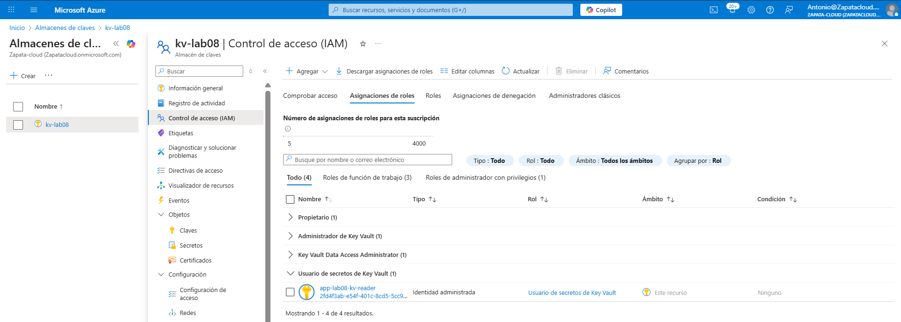

# Lab 08 — Azure Key Vault: RBAC y acceso seguro a secretos (usuarios y aplicaciones)

## Contexto (por qué hice este laboratorio)
En Azure, proteger secretos no va solo de “guardar contraseñas en un Key Vault”.  
Lo importante es **quién accede**, **con qué permisos** y **desde qué contexto** (persona vs aplicación).

En la práctica, me encuentro dos casos reales:
- **Usuarios humanos** que solo necesitan **consultar** un secreto puntual (sin tocar nada más).
- **Aplicaciones** que necesitan leer secretos **sin credenciales embebidas** (lo correcto hoy es Managed Identity).

Este laboratorio lo hice para validar **mínimo privilegio** en ambos escenarios usando **Azure RBAC** y, como extra, **Managed Identity**.

---

## Objetivo
Demostrar, de forma práctica, cómo controlar el acceso a Azure Key Vault aplicando:

- Mínimo privilegio para **usuarios humanos**.
- Acceso seguro desde **aplicaciones** usando **Managed Identity**.
- Validación real del acceso permitido y del acceso denegado.
- Evidencias con capturas.

---

## Escenario 1: Acceso humano con RBAC (mínimo privilegio)

### Qué se quiere conseguir
Un usuario de pruebas (`usuario_4`) que pueda **leer** un secreto existente, pero que **no pueda crear, modificar ni administrar** nada en el Key Vault.

### Configuración aplicada
- Key Vault configurado para usar **Azure RBAC** (no Access Policies).
- Usuario de pruebas: `usuario_4`.
- Rol asignado: **Usuario de secretos de Key Vault**.
- Ámbito: **Key Vault `kv-lab08`**.

### Resultado
- El usuario puede acceder a secretos existentes.
- Cualquier intento de crear o modificar secretos se bloquea.
- Se cumple el principio de **mínimo privilegio** sin sobreasignar permisos.

---

## Escenario 2: Acceso desde aplicación con Managed Identity (Extra)

### Por qué añadí este escenario
Quería validar un caso más real: una **aplicación** accediendo a secretos sin claves ni passwords hardcodeadas.

### Qué se montó
- Aplicación **Node.js** desplegada en **Azure App Service**.
- **Managed Identity** (asignada por el sistema) activada.
- Permiso RBAC en Key Vault para esa identidad: **Usuario de secretos de Key Vault**.
- Variable de entorno `KEYVAULT_URI` para apuntar al vault.

### Cómo funciona
La aplicación expone un endpoint `/secret` que:
- se autentica automáticamente usando Managed Identity,
- accede al secreto `demo-secret` en Azure Key Vault,
- devuelve el valor del secreto vía API.

---

## Recursos utilizados
- Azure Key Vault: `kv-lab08`
- Secreto de prueba: `demo-secret`
- Usuario de pruebas: `usuario_4`
- Azure App Service (Node.js)
- Managed Identity
- Modelo de permisos: Azure RBAC

---

## Evidencias

### 01) Asignación RBAC al usuario humano

### 02) Lectura correcta del secreto (usuario humano)

### 03) Acceso denegado al intentar crear/modificar (usuario humano)

---

## Evidencias (Extra — aplicación)

### 04) Managed Identity activada en App Service

### 05) RBAC en Key Vault: permiso a la identidad de la aplicación
Rol asignado a la identidad del App Service: **Usuario de secretos de Key Vault** (scope: `kv-lab08`).

### 06) La aplicación lee el secreto correctamente (endpoint `/secret`)

---

## Checklist final
- [x] El Key Vault usa **Azure RBAC** (no Access Policies)
- [x] `usuario_4` puede **leer** el secreto `demo-secret`
- [x] `usuario_4` **no puede** crear/modificar secretos
- [x] La aplicación usa **Managed Identity**
- [x] La identidad de la aplicación tiene rol **Usuario de secretos de Key Vault** en `kv-lab08`
- [x] La aplicación recupera el secreto desde Key Vault correctamente

---

## Qué explicaría en una entrevista
En este laboratorio separo claramente acceso humano vs acceso de aplicaciones:

- **Usuarios humanos:** RBAC con mínimo privilegio, permitiendo solo lectura cuando hace falta.
- **Aplicaciones:** Managed Identity + RBAC sobre Key Vault para evitar credenciales estáticas.

Esto reduce riesgos, evita sobrepermisos y es el enfoque que aplicaría en un entorno real en Azure.
